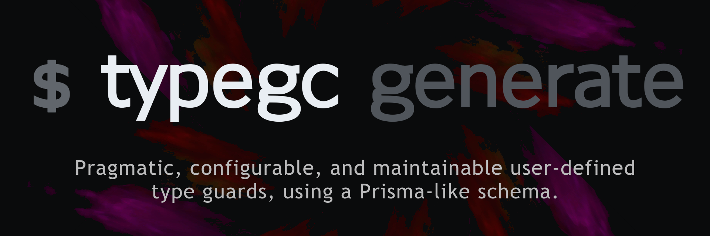

---

## What's this?

TypeGC was created when I got a little inspiration after I read a few messages in [The Coding Den](https://discord.gg/code)'s TypeScript channel.
The question was whether or not there was an easier way to make maintainable type guards for raw API data.
For example, if I have an interface called `APIError`, and another interface, similar in structure, called `UserError`, and I want a type guard to tell me if a value is an `APIError`, don't I need to check the value extensively to be absolutely sure that the value is in fact an `APIError` and not a `UserError`?

<details>
    <summary>Example code</summary>

```ts
/* First interface, named UserError */
interface UserError {
    status: number;
    message: string;
    endpoint: string;
    error: {
        message: string;
        stack: string;
    };
}

/**
 * Second interface, named APIError.
 * It's the same as UserError, and it's named differently because of:
 * - Semantics
 * - The data it will hold (status, for example, will hold different ranges of codes)
 * - Context
 */
interface APIError {
    status: number;
    message: string;
    endpoint: string;
    error: {
        message: string;
        stack: string;
    };
}

function manual(v: any): v is APIError {
    return (
        typeof v === "object" &&
        v &&
        typeof v["status"] === "number" &&
        v["status"] >= 400 &&
        v["status"] <= 599 &&
        typeof v["message"] === "string" &&
        typeof v["endpoint"] === "string" &&
        /(\/[^\/]*)+/.test(v["endpoint"]) &&
        typeof v["error"] === "object" &&
        v["error"] &&
        typeof v["message"] === "string" &&
        typeof v["stack"] === "string"
    );
}
```

</details>

Agh! What a nightmare to maintain! The documentation and implementations will all differ across developers and platforms!

Fortunately, there is something we can do to minimize the amount of ambiguity involved, which is obviously a single source of truth.
In TypeGC, our single source of truth, is of course the schema.

<details>
    <summary>Example schema</summary>

```txt
config {
  strict true
}

alias UserCode  range(400, 499)
alias ErrorCode range(400, 599)

define ErrorObject {
  message string
  stack   string
}

model UserError {
    status   number      UserCode
    message  string
    endpoint string      match("/users/([^/]*)+")
    error    ErrorObject
}

model APIError {
  status   number      ErrorCode
  message  string
  endpoint string      match("(/[^/]*)+")
  error    ErrorObject
}
```

</details>
